# Mô hình OSI, TCP/IP
### OSI - Open Systems Interconnection
- OSI - là mô hình tham chiếu mô tả cách hệ thống mạng giao tiếp với nhau dễ dàng. Mô hình chia thành 7 tầng, mỗi tầng đảm nhiệm một chức năng riêng, giúp các thiết bị và chỉ làm việc với tầng bên trên hoặc bên dưới khi có sự cố. 
- Các tầng giao tiếp với nhau thông qua các kênh logic (logic communication)
- Mô hình OSI có 2 loại thao thức:
    - Giao thức hướng kết nối (Connection-oriented) - TCP: chậm, an toàn, cần thiết lập kênh
    - Giao thức không kết nối (Connectionless) - UDP: nhanh, không an toàn, không cần thiết lập kênh
- `Application Layer` - Tầng Ứng Dụng:
    - Cung cấp dịch vụ mạng cho các ứng dụng của người dùng
    - Cho phép ứng dụng truy cập tài nguyên mạng
    - Mỗi dịch vụ sử dụng giao thức và cổng riêng (port)
    - Ex: HTTP - 80, FTP - 20 21, SMTP - 25 , DNS - 53
- `Presentation Layer` - Tầng Biểu Diễn: 
    - Biểu diễn và chuyển đổi dữ liệu giữa định dạng của ứng dụng và định dạng mạng.
    - Chuyển đổi kiểu dữ liệu, mã hóa ký tự,
    - Thực hiện: 
        - Mã hóa/giải mã (encryption/decryption)
        - Nén/giải nén dữ liệu (compression)
    - Đảm bảo hai hệ thống hiểu cùng một các biểu diễn dữ liệu.
- `Session Layer` - Tầng Phiên:
    - Thiết lập, duy trì và hủy bỏ phiên làm việc giữa các thiết bị đầu cuối.
    - Đồng bộ dữ liệu trong quá trình truyền
    - Quản lý hội thoại giữa hai bên (ai gửi - ai nhận)
- `Transport Layer` - Tầng Giao Vận:
    - Vận chuyeernm dữ liệu đầu cuối - đầu cuối (end-to-end) giữa các host
    - Chia dữ liệu lớn thành các segment nhỏ và đánh số thứ tự.
    - Đảm bảo truyền tin tin cậy và đúng thứ tự đã được đánh số
    - Phát hiện lỗi, truyền lại khi mất gói.
    - Điều khiển luồng (flow control)
    - Sử dụng port để phân biệt các tiến trình
- `Network Layer` - Tầng Mạng:
    - Định tuyến các gói tin từ nguồn đến đích qua nhiều mạng khác nhau.
    - Xác định đường đi tối ưu (routing).
    - Sử dụng địa chỉ logic (IP Address)
    - Có thể thực hiện phân mảnh gói tin (fragmentation)
    - Điều khiển tắc nghẽn (Congestion Control)
- `Data Link Layer` - Tầng Liên Kết Dữ Liệu
    - Thiết lập, duy trì và hủy bỏ liên kết dữ liệu giữa các nút liền kề
    - Đóng gói dữ liệu thành frame
    - Đánh địa chỉ vật lý (MAC address)
    - Kiểm soát lỗi (CRC - Cyclic Redundancy Check) và kiểm soát lưu lượng
    - Truyền và nhận frame, xử lý (ACK - Acknowledgement Frame)
- `Physical Layer` - Tầng Vật Lý:
    - Là tầng thấp nhấp trong mô hình OSI
    - Truyền dữ liệu dưới dạng bit (0 và 1) 
    - Duy trì và giải phóng kết nối vật lý
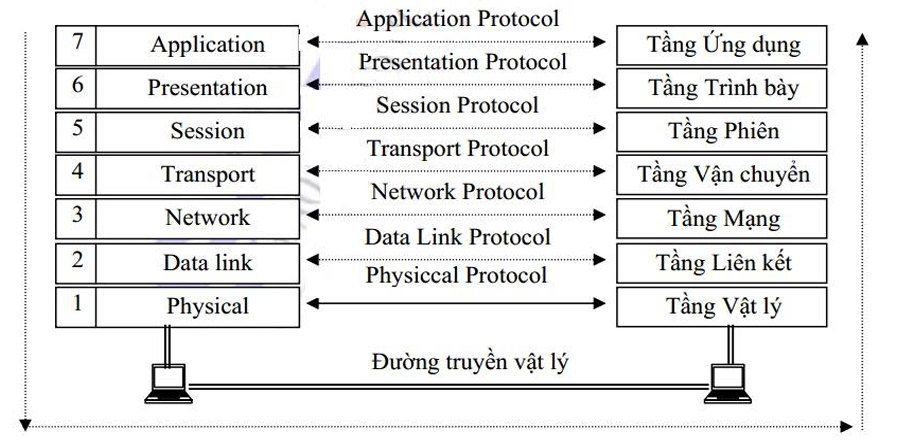

### TCP/IP - Transmission Control Protocol/Internet Protocol
- TCP/IP là bộ giao thức mạng thực tế đang được sử dụng trên Internet.
- Khác với OSI (mô hình tham chiếu), TCP/IP là mô hình triển khai + tập hợp các giao thức cụ thể.
- Được thiết kế đơn giản hơn OSI và thường chia thành 4 tầng.
- Đảm bảo dữ liệu được truyền tải qua mạng hiệu quả, linh hoạt và có thể tin cậy (TCP, UDP).
- `Application Layer` - Tầng Ứng Dụng:
    - Gộp chức năng của Application + Presentation + Session trong OSI.
    - Cung cấp dịch vụ mạng trực tiếp cho các chương trình ứng dụng.
- `Transport Layer` - Tầng Giao Vận: TCP và UDP
    - Cung cấp dịch vụ vận chuyển dữ liệu end-to-end giữa host nguồn và host đích.
    - Thiết lập kết nối logic giữa hai đầu cuối.
    - Chia dữ liệu thành segment và đánh số thứ tự.
    - Sử dụng port để phân biệt các tiến trình/ứng dụng.
    - Có 2 cơ chế:
        - TCP: hướng kết nối, tin cậy, kiểm soát lỗi, điều khiển luồng
        - UDP: không kết nối, nhanh, không đảm bảo tin cậy
- `Internet Layer` - Tầng Liên Mạng: 
    - Cung cấp địa chỉ logic (IP address) cho các thiết bị.
    - Định tuyến gói tin giữa nhiều mạng khác nhau.
    - Xác định đường đi từ nguồn đến đích (routing).
    - Đóng gói dữ liệu thành packet (IP packet).
    - Hỗ trợ ánh xạ giữa địa chỉ IP và MAC thông qua:
        - Giao thức phân giải địa chỉ ARP (Address Resolution Protocol)
        - Phân giải địa chỉ đảo RARP (Reverse Address Resolution Protocol)
- `Network Access Layer` - Tầng Truy Cập Mạng:
    - Gộp chức năng của Data Link + Physical trong OSI.
    - Cung cấp phương tiện kết nối vật lý: Cáp, card mạng, tín hiệu điện/quang
    - Đóng gói dữ liệu thành frame để truyền trên môi trường vật lý.
    - Địa chỉ MAC, truyền frame, phát hiện lỗi (CRC).
    - Quy định cách truy nhập đường truyền.
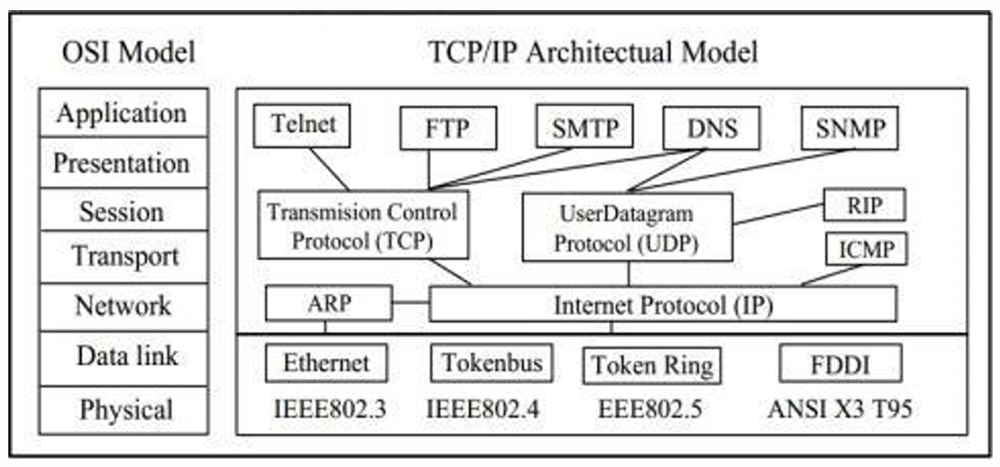

---
# Switching
- `Switch (Bộ Chuyển Mạch)` - thiết bị mạng dùng để kết nối các thiết bị trong cùng một LAN như máy tính, server, printer,... và điều hướng data pakcet (gói tin) đến đúng đích.
    - Cho phép nhiều thiết bị dùng chung một mạng.
    - Giảm xung đột và tránh lưu lượng (traffic) của thiết bị này ảnh hưởng đến thiết bị khác
    - Chỉ gửi dữ liệu đến đúng thiết bị nhận, không phát tán toàn mạng.
- Switch giống như cảnh sát giao thông tại ngã tư: khi một gói tin đi vào một port nào đó, switch kiểm tra địa chỉ (MAC address) để xác định đích và chuyển tiếp qua đúng port
- Có 3 cơ chế:
    - `Circuit` Switching: thiết lập đường truyền riêng cố định trước khi truyền dữ liệu.
    - `Message` Switching: gửi toàn bộ message một lần, từng node lưu rồi chuyển tiếp.
    - `Packet` Switching: chia dữ liệu thành packet nhỏ, đi nhiều đường khác nhau và ghép lại ở đích.

---
# Routing
- Routing (Định Tuyến) - lựa chọn đường đi tốt nhất để chuyển các gói tin từ nguồn đến đích. 
    - Route Selection: xác định đường đi tối ưu
    - Forwarding: gửi gói tin qua các node trung gian
    - Bảng định tuyến: lưu trữ và cập nhật thông tin các tuyến đường
> Routing ≠ Router (Bộ định tuyến). Router là thiết bị thực hiện routing

---
# Các giao thức trong mạng Internet
- `Internet Protocol Suite` (Bộ giao thức liên mạng) - Là tập hợp các giao thức truyền thông của Internet, quy định cách đóng gói, truyền, định tuyến và nhận dữ liệu giữa các thiết bị mạng. Hay còn gọi là TCP/IP
> Application – dịch vụ (HTTP, FTP, DNS…) → Transport – truyền tin (TCP/UDP) → Internet – định tuyến (IP) → Network Access – vật lý (Ethernet/Wi-Fi) 
- `Protocol Stack` - tập hợp đầy đủ các lớp giao thức, hoạt động dùng để cung cấp tăng khả năng kết nối mạng.
- `Transmission Control Protocol` (TCP) - Giao thức tầng Transport cung cấp truyền dữ liệu tin cậy, đúng thứ tự, có kiểm soát lỗi.
Dùng cho Web, Email, FTP, SSH.
- `Internet Protocol` (IP) - Giao thức tầng Internet dùng để đánh địa chỉ IP và định tuyến gói tin giữa các mạng.
Hoạt động không kết nối, không đảm bảo (best-effort).
- `Hypertext Transfer Protocol` (HTTP - 80/TCP) - Giao thức truyền tải dữ liệu Web (request–response), không mã hóa.
- `Hypertext Transfer Protocol over SSL/TLS` (HTTPS - 443/TCP) - HTTP chạy trên SSL/TLS, mã hóa và bảo mật dữ liệu.
- `File Transfer Protocol` (FTP - 20 [data], 21 [control]) - Giao thức truyền file giữa client–server, không mã hóa mặc định, dùng 2 kênh.
- `Secured Shell` (SSH - 22/TCP) - Giao thức điều khiển máy từ xa an toàn (mã hóa), thay thế Telnet.
- `Telnet` (23/TCP) - Điều khiển từ xa không mã hóa, kém bảo mật.
- `Simple Mail Transfer Protocol` (SMTP - 25, 587, 465 [SSL] ) - Giao thức gửi email giữa client và mail server.
- `Post Office Protocol v3` (POP3 - 110, 995 [SSL]) - Giao thức tải email về máy và thường xóa trên server.
- `Internet Message Access Protocol` - Giao thức đọc và quản lý mail trực tiếp trên server, đồng bộ nhiều thiết bị.
- `Domain Name System` (DNS - 53/UDP, 53/TCP) - Hệ thống phân giải tên miền → địa chỉ IP.
- `Simple Network Management Protocol` (SNMP - 161 [query], 162 [trap]) - Giao thức giám sát và quản lý thiết bị mạng (router, switch…).

---
# NAT
- **NAT (Network Address Translation)** là cơ chế cho phép chuyển đổi địa chỉ IP private (nội bộ) sang IP public (bên ngoài Internet) thông qua router.
- Cách hoạt động: 
    - Các máy trong mạng nội bộ (ví dụ: máy ảo) dùng IP private để giao tiếp với nhau.
    - Khi truy cập Internet, router sẽ đổi IP private thành IP public của mạng vật lý (WiFi/LAN) rồi mới gửi dữ liệu ra ngoài.
    - khi truyền ra ngoài Internet Khi máy ảo giao tiếp với bên ngoài, địa chỉ IP nội bộ sẽ được chuyển thành địa chỉ IP của mạng vật lý (WIFI) để truyền dữ liệu lên Internet.
    - Khi phản hồi quay về, router sẽ dịch ngược lại để chuyển đúng về máy ban đầu.
- Ưu điểm: 
    - Ẩn IP nội bộ → tăng bảo mật
    - Cho phép nhiều máy dùng chung 1 IP public
    - Dễ cấu hình, phù hợp cho máy ảo/lab mạng
- Có gateway cố định: thường là .2
- DHCP tự động cấp IP cho máy trong dải: .1 → .254

---
# Firewall
- Firewall (Tường lửa) - hệ thống dùng để kiểm soát và lọc lưu lượng mạng, ngăn truy cập trái phép từ Internet vào mạng nội bộ
- Tạo ra hàng rào cản an toàn giữa mạng nội bộ và mạng Internet 
- Dựa vào các quy tắc của ACL - Access Control List: lọc theo IP, Port, Protocol, Domain, Program,...
- Host-base Firwall: cài trên từng máy (PC/Server), bảo vệ riêng lẻ
- Network-base Firewall: đặt tại router/gateway, bảo vệ toàn bộ mạng
- Rất cần thiết để giữ an toàn hệ thống 

---
# Cài hệ điều hành ubuntu trên VMware 
#### B1: Cài đặt Ubuntu Server
- Cài đặt phiên bản server. [Tải Ubuntu Server tại đây](https://ubuntu.com/download/server)
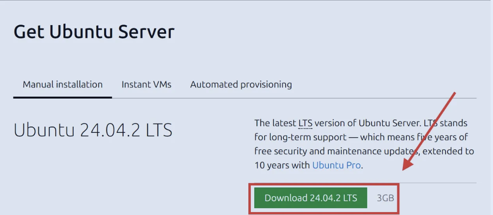
#### B2: Tạo máy ảo Ubuntu trên VMware
- Mở **VMware**, chọn Create a New Virtual Machine để khởi tạo máy ảo Ubuntu.
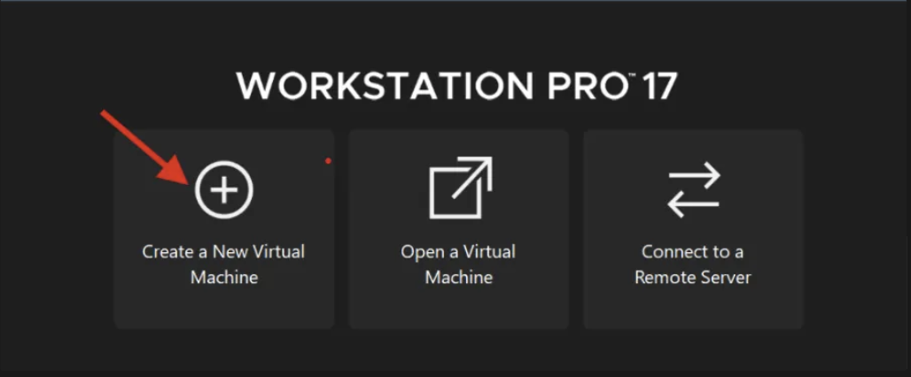
- Nhấn **Next** để tiếp tục.
- Ở bước tiếp theo, chọn file ISO Ubuntu Server bạn đã tải về trước đó.
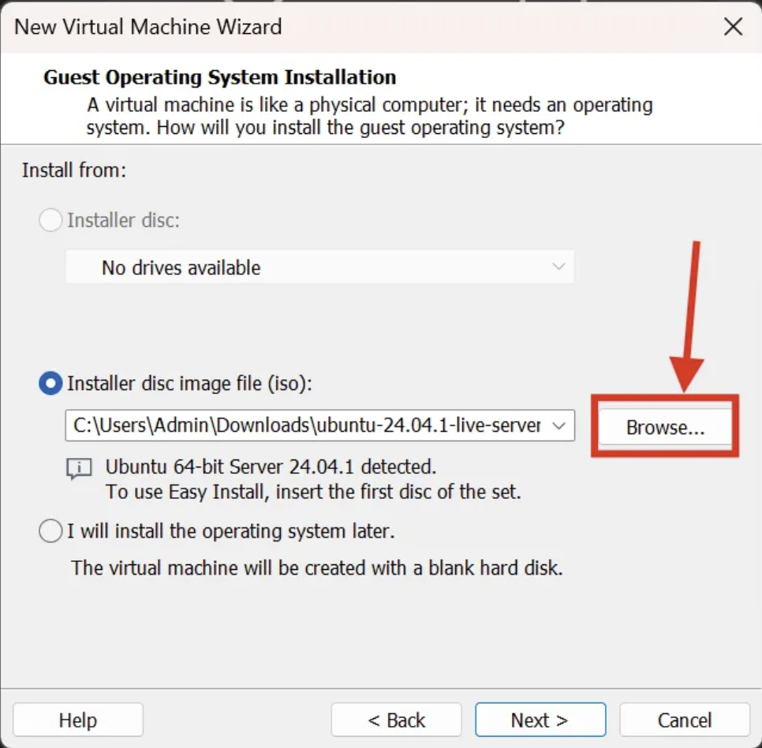
- Chọn xong file ISO → Nhấn **Next** để tiếp tục cấu hình máy ảo.
#### B3: Cài đặt Ubuntu Server trong máy ảo
- Khởi động máy ảo, bắt đầu cài đặt Ubuntu Server.
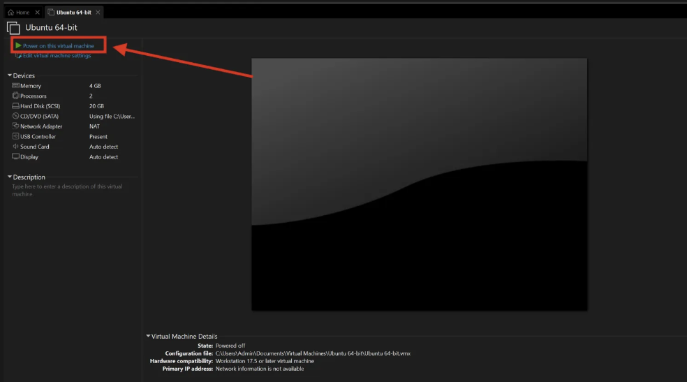
- Dùng chuột click vào mũi tên → Nhấn **Enter** để tiếp tục.
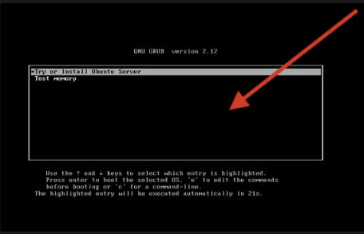
- Cài đặt ngôn ngữ → Nhấn **Enter**.
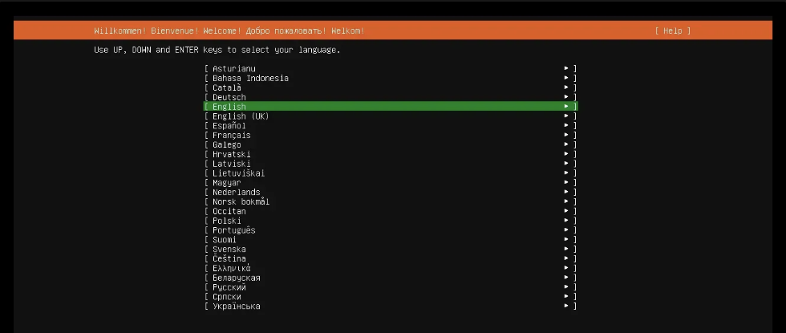
- Bỏ qua quá trình cập nhật cài đặt → Chọn **Continue without updating** → Nhấn **Enter**.
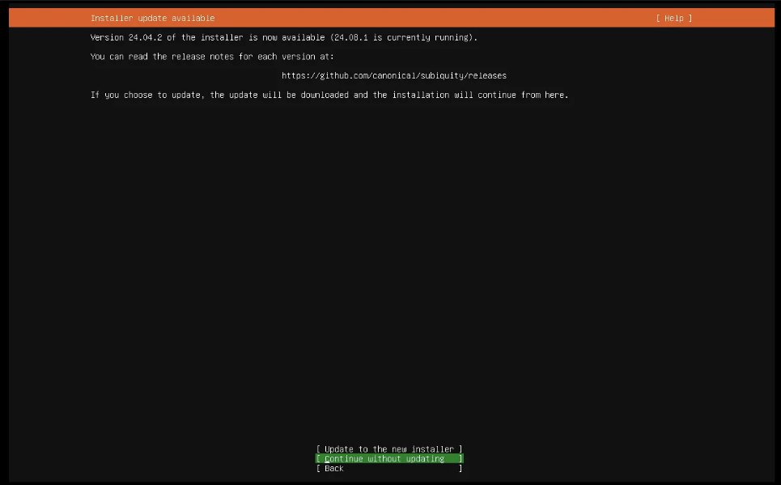
- Chọn bố cục bàn phím phù hợp → Nhấn **Done** → Enter.
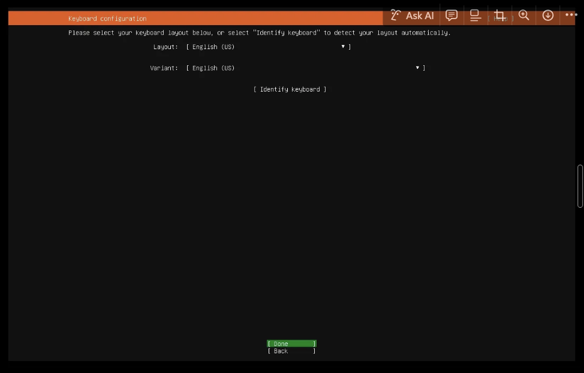
- Cấu hình giao diện mạng → Giữ mặc định → Nhấn **Done** → Enter.
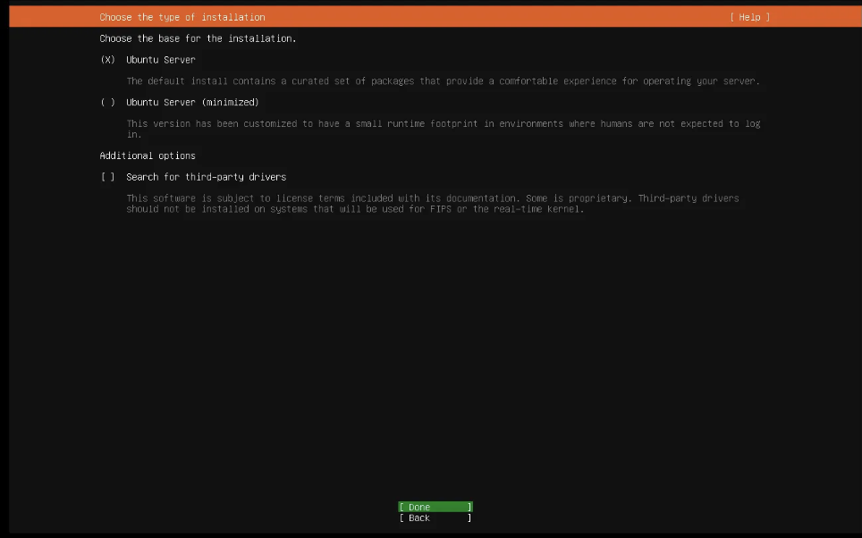
- Cấu hình proxy → Giữ trống nếu không dùng → Nhấn **Done** → Enter.
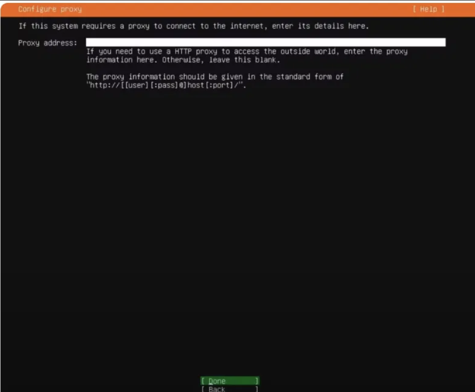
- Cấu hình Ubuntu Archive Mirror → Giữ mặc định → Nhấn **Done** → Enter.
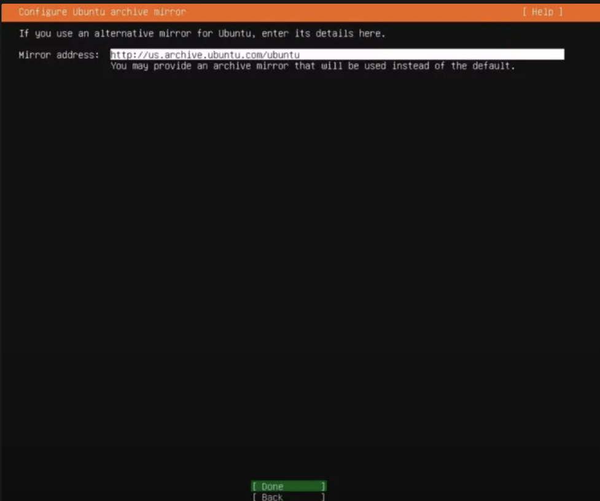
- Cấu hình phân vùng ổ đĩa (lưu trữ) → Chọn **Use Entire Disk** (nếu chưa tùy chỉnh) → Nhấn **Done** → Enter.
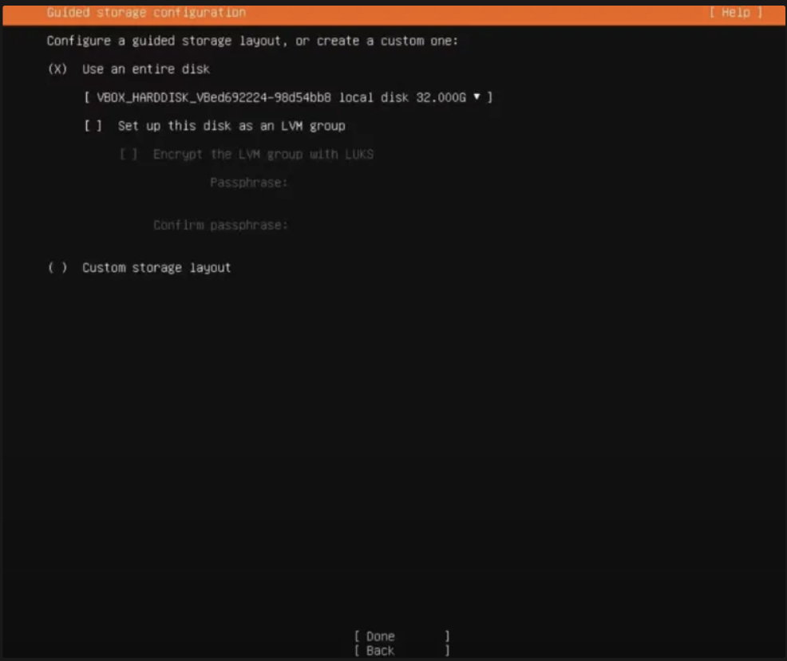
- Nhập thông tin hồ sơ người dùng (username, password, hostname…)
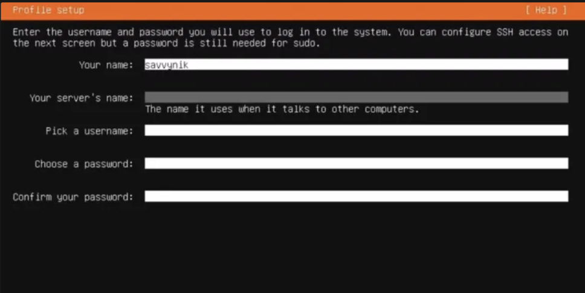
- Sau khi điền xong, chọn **Done** → Nhấn Enter để tiếp tục.
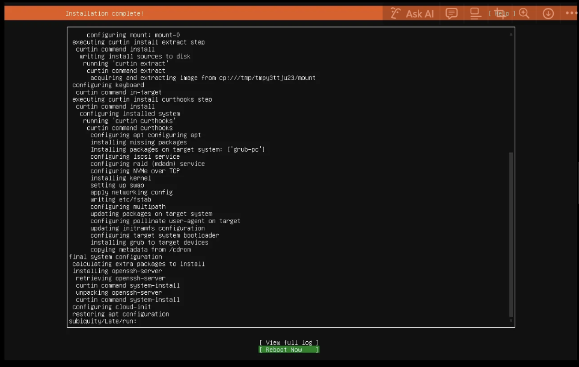
- Cài đặt xong → Nhấn **Reboot** để khởi động lại và hoàn tất quá trình.
#### B4: Bước 4: Đăng nhập và cập nhật hệ thống
- Đăng nhập vào hệ thống.
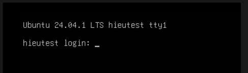
- Sau khi đăng nhập, cập nhật hệ thống bằng lệnh sau:
```bash
sudo apt update && sudo apt upgrade
```

---
# Tìm hiểu network trong VMware
### Bridge
- VM kết nối trực tiếp vào mạng LAN vật lý như một máy thật
- Cùng dải IP/Subnet với mạng thật (do DHCP router cấp)
### Host-Only
- Mạng nội bộ giữa Host với VM
- Không truy cập Internet
- Mạng riêng hoàn toàn, cô lập, an toàn
### NAT
- VM dùng IP private
- Khi ra Internet, NAT chuyển private → IP của Host
- Ra Internet được, bên ngoài không thể truy cập trực tiếp vào VM
- An toàn, hay dùng
### Custom Network (VMnet8)
- Cấu hình bằng VMware Virtual Network Editor
- Tạo mạng riêng theo yêu cầu
- Có thể bật DHCP, NAT hoặc chỉnh Subnet

---
# Cấu hình IP tĩnh trong Ubuntu
#### B1: Xem cấu hình mạng vật lý hiện tại
```bash
ip a
```
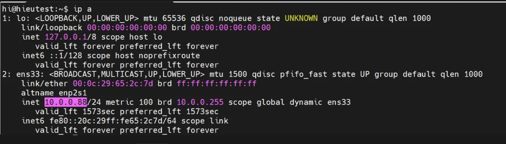
- Hiện tại card mạng là `ens33`
#### B2: Chỉnh sửa file cấu hình mạng
- Liệt kê file cấu hình mạng
```bash 
ls ls /etc/netplan/
```
- Hiện tại file cấu hình có tên `50-cloud-init.yaml`
- Mở file cấu hình để chỉnh sửa
```bash
sudo nano /etc/netplan/50-cloud-init.yaml
```
- script cấu hình IP tĩnh
```bash
network:
  version: 2
  ethernets:
    ens33:
      dhcp4: false
      addresses:
        - 10.0.0.86/24
      nameservers:
        addresses: [8.8.8.8, 1.1.1.1]
```
- Sau khi chỉnh sửa file trong nano, nhấn:**Ctrl + X** → **Y (yes)** → **Enter**
#### B3: Áp dụng và kiểm tra lại IP
```bash
sudo netplan apply
ip a
```
- ping tới google để kiểm tra mạng có hoạt động không
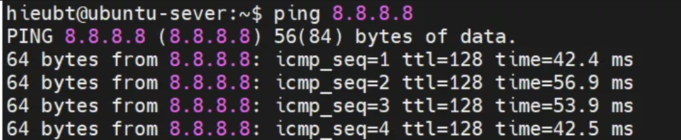

---

---
# Limit Bandwidth
- `Limit Bandwidth` (Giới Hạn Băng Thông) - iệc kiểm soát lượng dữ liệu được truyền qua mạng trong một khoảng thời gian nhất định - Đơn vị: Mbps(megabit per second)
    - Tránh nghẽn mạng
    - Phân phối tài nguyên mạng hợp lý
    - Ưu tiên dịch vụ quang trọng
- Tools: cấu hình trên Router hỗ trợ QoS hoặc Bandwidth Shaping
- Traffic Shaping / Bandwidth Shaping: kiểm soát tốc độ gửi/nhận dữ liệu theo mức đã đặt
> Ví dụ: Một Router có băng thông 100 Mbps và phân bổ cho 3 nền tảng: Zoom 40 Mbps, Google 30 Mbps, VPN 5 Mbps; Priority lần lượt: Cao, Trung bình, Thấp.

> Cài Zoom tối đa 40 Mbps thì hệ thống đảm bảo Zoom không vượt quá 40 Mbps dù còn băng thông trống. Đây gọi là Limit Bandwidth.
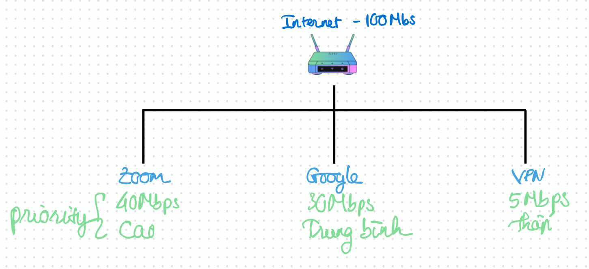

---
# Keepalived + Lab
### Keepalived
**Keepalived** - phần mềm giúp hệ thống mạng luôn hoạt động liên tục ngay cả khi có sự cố xảy ra. Khi một máy chủ chính bị lỗi (như tắt máy, mất kết nối), Keepalived sẽ tự động kích hoạt máy dự phòng (backup) để thay thế, đảm bảo hệ thống không bị gián đoạn.
- Thường được dùng để:
    - Giám sát tình trạng hoạt động của các máy chủ.
    - Tự động chuyển địa chỉ IP ảo (VIP) sang máy khác khi máy chính gặp sự cố.
    - Sử dụng giao thức VRRP để đảm bảo luôn có một máy chủ chính (Master) giữ địa chỉ IP ảo.
- **VRRP** - giao thức cho phép nhiều thiết bị cùng chia sẻ một địa chỉ IP ảo (VIP).
- Trong một nhóm VRRP:
    - Sẽ có một máy giữ vai trò Master, là máy đang sở hữu và sử dụng VIP.
    - Các máy còn lại sẽ là Backup, chỉ chờ Master gặp sự cố để thay thế.
    - Nếu Master bị tắt hoặc mất kết nối, một máy Backup sẽ tự động trở thành Master mới và giành quyền giữ VIP.
    - Khi Master cũ hoạt động lại, nếu nó có độ ưu tiên cao hơn, VIP sẽ quay về lại Master ban đầu.
### LAB
- Đây là mô hình lab keepalived kết hợp với Nginx
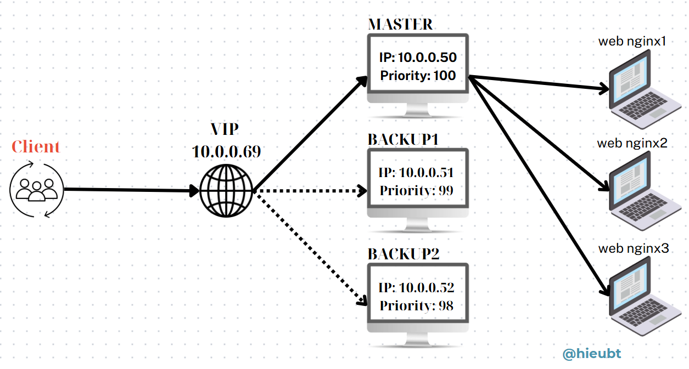
- **Cài đặt keepalived và nginx**
    - Chạy trên 3 máy ảo
```bash
sudo apt update
sudo apt install keepalived nginx -y
```
    - Tạo text cho web để dễ kiểm tra
```bash
echo "This is MASTER" | sudo tee /var/www/html/index.html     # máy 10.0.0.50
echo "This is BACKUP1" | sudo tee /var/www/html/index.html     # máy 10.0.0.51
echo "This is BACKUP2" | sudo tee /var/www/html/index.html     # máy 10.0.0.52
```
- **Cấu hình keepalived cho từng máy ảo**
    - mở và chỉnh file cấu hình.
```bash
sudo nano /etc/keepalived/keepalived.conf
```
Máy MASTER - 10.0.0.50 
```bash
vrrp_instance VI_1 {
    state MASTER
    interface ens33
    virtual_router_id 51
    priority 100
    advert_int 1

    virtual_ipaddress {
        10.0.0.69
    }
}
```
Máy BACKUP1 - 10.0.0.51
```bash
vrrp_instance VI_1 {
    state BACKUP1
    interface ens33
    virtual_router_id 51
    priority 99
    advert_int 1

    virtual_ipaddress {
        10.0.0.69
    }
}
```
Máy BACKUP2 - 10.0.0.52
```bash
vrrp_instance VI_1 {
    state BACKUP2
    interface ens33
    virtual_router_id 51
    priority 98
    advert_int 1

    virtual_ipaddress {
        10.0.0.69
    }
}
```
> Giải thích:
`vrrp_instance`: Tạo tên cho một instance VRRP
`state`: trạng thái của máy ảo
`interface`: card mạng của máy ảo.
`virtual_router_id`: ID của nhóm VRRP (phải giống nhau)
`priority`: Ưu tiên cao nhất → giữ VIP.
`advert_int 1`: Gửi gói thông báo mỗi 1 giây.
`virtual_ipaddress`: Gán địa chỉ IP ảo (VIP) vào máy này.

- **Khởi động keepalived**
    - Trên cả 3 máy ảo
```bash
sudo systemctl restart keepalived
sudo systemctl enable keepalived
``` 
    - Kiểm tra hoạt động của 3 máy ảo
```bash
service keepalived status
```
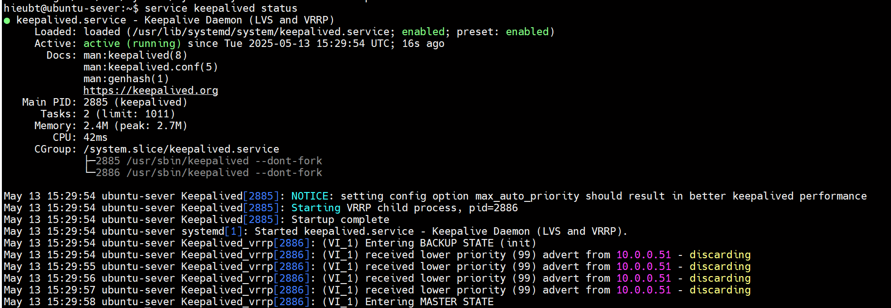
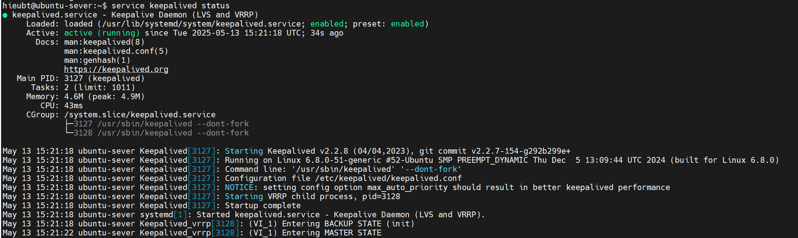
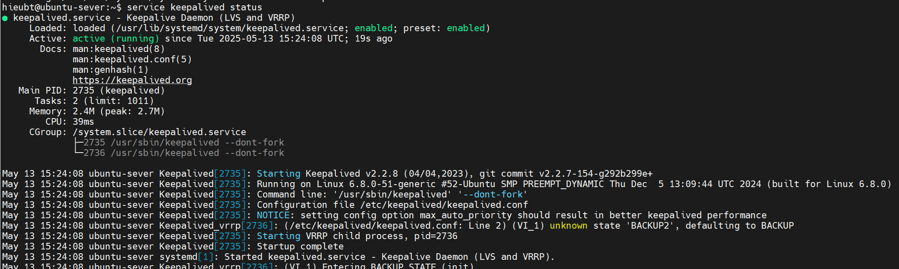
- **Test Web Nginx**
    - Chạy VIP lên trình duyệt chorme: `10.0.0.69`
    
> hiện tại web đang dùng IP máy MASTER
Khi tôi tắt máy MASTER thì web sẽ tự động chuyển sang IP máy BACKUP1
```bash
service keepalived stop 
```
    - sau đó load lại web thì nó sẽ chuyển sang web BACKUP1
    
    - tiếp tục thử tắt máy ảo BACKUP1 thì web sẽ chuyển sang BACKUP2
    
    - cuối cùng start lại máy MASTER xem web có chuyển sang Web MASTER không
```bash
service keepalived start
```

- **Kết luận**
    - Mô hình hoạt động của Keepalived với 3 node
    - Trong mô hình này, địa chỉ IP ảo (VIP: 10.0.0.69) được chia sẻ giữa 3 máy chủ. Keepalived sử dụng giao thức VRRP để đảm bảo rằng chỉ một máy (ưu tiên cao nhất) giữ địa chỉ VIP tại một thời điểm.
    - Khi máy Master (priority 100) gặp sự cố, máy Backup1 (priority 99) sẽ tự động đảm nhận VIP. Nếu tiếp tục xảy ra lỗi, Backup2 (priority 98) sẽ thay thế. Điều này giúp đảm bảo dịch vụ không bị gián đoạn và tăng tính sẵn sàng của hệ thống.

---
# Tool debug, config network
### Tool debug
- Kiểm tra kết nối Internet (có ra ngoài được không)
- Kiểm tra DNS + Internet
```bash
ping 8.8.8.8
ping google.com
```
-  Xem đường đi gói tin, tìm hop bị nghẽn/timeout
```bash
traceroute google.com 
``` 
- Xem IP, subnet, trạng thái card mạng (máy đã nhận IP chưa)
```bash
ip a
```
- Xem bảng định tuyến, có default gateway không
```bash
ip r
```
- port TCP/UDP đang lắng nghe (dịch vụ đang mở)
- các kết nối TCP đang hoạt động
```bash
ss -tuln 
ss -ant 
```
- Kiểm tra phân giải DNS
```bash
nslookup google.com 
```
- Bắt packet để debug traffic
```bash
sudo tcpdump -i eth0 
sudo tcpdump host 8.8.8.8
```
- Bắt & phân tích packet bằng GUI
```bash
wireshark
```
### Config network
```bash
sudo nano /etc/netplan/50-cloud-init.yaml   # sửa cấu hình
sudo netplan apply                         # áp dụng cấu hình
ip route                                   # kiểm tra route
```

---
# Tìm hiểu khái niệm ssh-key, và thực hành trên Ubuntu
### SSH Key là gì ?
- SSH Key là một cặp khóa mã hóa dùng để xác thực người `client` và `server` thông qua giao thức SSH(Secure Shell) mà không cần dùng mật khẩu. Cơ chế dựa trên mã bất đổi xứng:
  - Public Key(khóa công khai): Dùng để chia sẻ và đặt trên server.
  - Private Key(khóa bí mật): Giữ bí mật, lưu trên máy client. Không bao giờ được chia sẽ
> chỉ private key mới có thể giải mã những gì đã được mã hóa bởi public key.

### Tại sao SSH Key an toàn hơn mật khẩu ?
- Không thế dùng `brute-force` như các mật khẩu yếu
- Không bị đánh cắp qua `phishing` như password
- Có thể giới hạn IP, command hay thời gian sử dụng.
- Private key có thể được bảo vệ bằng `passphrase`, thêm lớp bảo mật thứ hai.

|              | Public Key              | Private Key               |
|--------------|---------------------------|------------------------------|
| Lưu trữ ở     | Trên server                | Trên client                  |
| Chức năng     | Mã hóa dữ liệu             | Giải mã dữ liệu              |
| Bảo mật       | Có thể công khai           | Bắt buộc giữ bí mật          |
| Định dạng     | `id_rsa.pub`, `id_ecdsa.pub`,... | `id_rsa`, `id_ecdsa`,...      |

### Thực hành 
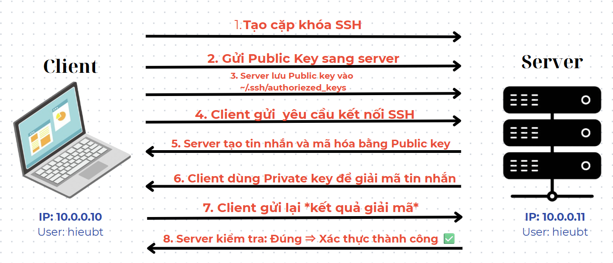

#### 1. Tạo cặp khóa SSH Key
```bas=
ssh-keygen -t rsa -b 2048 -C "hieubt@client"
```
> `-t rsa`: Tạo khóa RSA.
> `-b 1024`: Độ dài khóa 1024 bit (càng cao càng bảo mật cao).
> `-C "hieubt@client"`: Thêm nhãn để nhận diện key.
> Sau khi chạy lệnh:
> `Private key` lưu tại ~/.ssh/id_rsa (giữ bí mật).
> `Public key` lưu tại ~/.ssh/id_rsa.pub

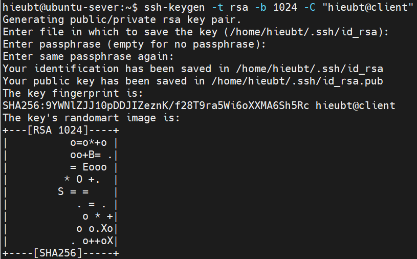

#### 2. Gửi Public Key từ Client sang Server
```bash=
ssh-copy-id hieubt@10.0.0.11
```
> Lệnh `ssh-copy-id` tự động copy public key vào file `~/.ssh/authorized_keys` trên Server.
> Nhập mật khẩu của `user hieubt` trên Server khi được hỏi.

#### 3. Client gửi yêu cầu SSH
```bash=
ssh hieubt@10.0.0.11
```
- Public key đã được thêm vào file `~/.ssh/authorized_keys`
```bah=
ssh hieubt@10.0.0.11 "cat ~/.ssh/authorized_keys"
```
> sẽ hiện thị nội dung đã copy
> Được thực hiện tự động tại máy Server (10.0.0.11) sau lệnh ở bước 2.
> 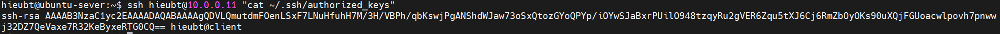

#### 4. Client gửi yêu cầu kết nối SSH
```bash=
ssh hieubt@10.0.0.11
```
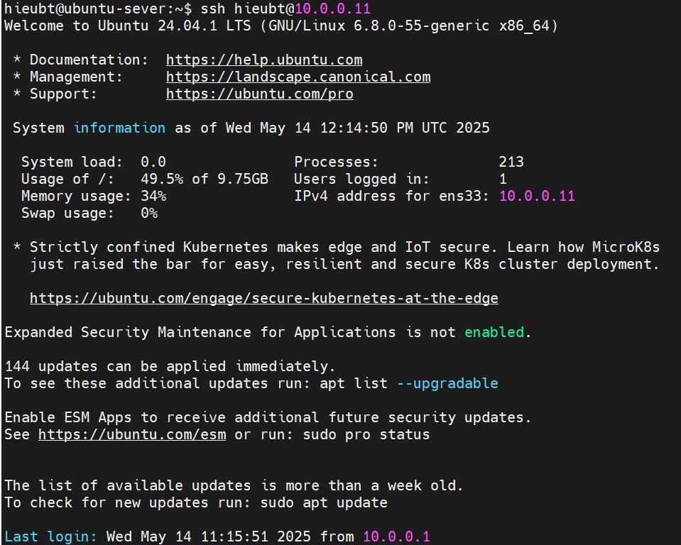
> như vậy đã đăng nhập thành công


---
# Policy Routing + LAB trên VMware


