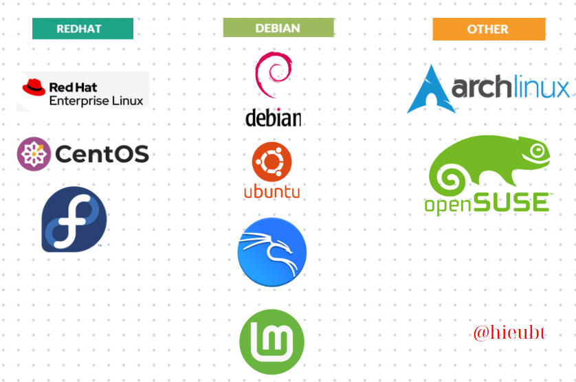
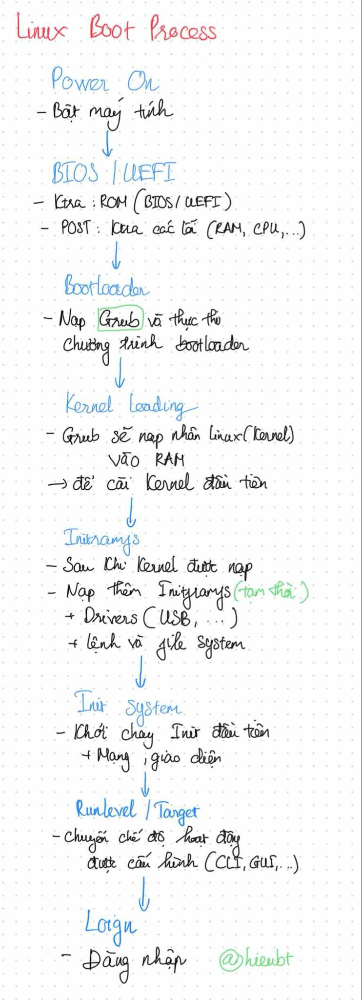

# Nguồn gốc của Unix
> - Năm 1964, MIT, Bell Labs và GE cùng phát triển một hệ điều hành tiên tiến tên là Multics. Nhưng do quá phức tạp, Bell Labs rút lui khỏi dự án.
> - Năm 1969, tại Bell Labs, Ken Thompson viết một hệ điều hành mới trên máy PDP-7 – gọi là UNICS, sau đổi tên thành UNIX.
> - Đến năm 1973, Dennis Ritchie và Thompson viết lại UNIX bằng ngôn ngữ C →  giúp nó có thể chạy được trên nhiều loại máy khác nhau – một bước đột phá lớn.
> - UNIX nhanh chóng lan rộng trong giới học thuật. Tại UC Berkeley, họ phát triển ra một biến thể riêng gọi là BSD.
> - Năm 1983, AT&T chính thức phát hành UNIX System V – phiên bản thương mại đầu tiên.
- **Unix** là một hệ điều hành đa nhiệm, chủ yếu dùng cho doanh nghiệp/server 
- Khác với `Windows` hay `MacOS` chủ yếu dùng cho cá nhân. HĐH Unix ổn định, bảo mật và khả năng vận hành lâu dài hơn.
- Một số hệ điều hành dựa trên Unix:
  - BSD
  - Minix
  - Linux: (Có nhiều bản phân phối - distribution)
    - Red Hat: RHEL, CentOS
    - Debian: Ubuntu, Kali Linux
> Tất cả những phần này điều dùng `POSIX` để viết những `Command-line`

---
# Linux là gì? bắt nguồn từ đâu? Sự khác biệt cơ bản giữa Linux và Windows
- `Linux` là một hệ điều hành có mã nguồn mở (Open-source - OS),  được tạo ra vào năm 1991 bởi `Linus Torvalds`.
- Được cộng đồng phát triển rộng rãi, `Linux` hiện nay được sử dụng trên nhiều thiết bị như: máy chủ, thiết bị nhúng, máy tính cá nhân, siêu máy tính...

- So sánh sự khác biệt Linux -  Windows

| **Tiêu chí**               | **Linux**                                                                                                                                      | **Windows**                                                                                                                       |
|----------------------------|------------------------------------------------------------------------------------------------------------------------------------------------|------------------------------------------------------------------------------------------------------------------------------------|
| **Tính chất mã nguồn**     | Mã nguồn mở, người dùng có quyền truy cập, thay đổi và phân phối lại mã nguồn.                                                                | Mã nguồn đóng, phát triển độc quyền bởi Microsoft.                                                                                |
| **Bảo mật**                | Bảo mật cao hơn nhờ khả năng cập nhật nhanh, ít bị tấn công do thị phần nhỏ.                                                                  | Thường là mục tiêu của phần mềm độc hại do thị phần lớn hơn.                                                                     |
| **Quản lý tài nguyên**     | Hoạt động tốt trên phần cứng yếu, sử dụng ít tài nguyên hệ thống.                                                                             | Tiêu thụ nhiều tài nguyên, đặc biệt trên hệ thống cấu hình thấp.                                                                 |
| **Cập nhật hệ thống**      | Rolling-release hoặc fixed-release, không yêu cầu khởi động lại khi cập nhật.                                                                 | Cập nhật bắt buộc, thường yêu cầu khởi động lại, đôi khi gây gián đoạn công việc.                                                |
| **Cộng đồng hỗ trợ**       | Cộng đồng mã nguồn mở lớn, hỗ trợ từ diễn đàn và wiki.                                                                                         | Hỗ trợ chính thức từ Microsoft và cộng đồng người dùng lớn.                                                                      |
| **Khả năng tùy chỉnh**     | Tùy chỉnh cao, người dùng có thể thay đổi từ kernel đến giao diện người dùng.                                                                 | Giới hạn về tùy chỉnh, phần lớn dựa vào các cài đặt sẵn có.                                                                      |
| **Ứng dụng và phần mềm**   | Phần mềm mã nguồn mở nhiều, phải sử dụng Wine để chạy ứng dụng Windows.                                                                       | Nhiều phần mềm thương mại hỗ trợ, đặc biệt trong môi trường doanh nghiệp.                                                        |
| **Phù hợp cho máy chủ**    | Phổ biến cho máy chủ web và máy chủ doanh nghiệp nhờ tính ổn định và bảo mật cao.                                                              | Ít phổ biến hơn trong môi trường máy chủ, nhưng Windows Server được sử dụng nhiều trong doanh nghiệp.                            |
| **Giá thành**              | Miễn phí, đa số các bản phân phối Linux không có phí bản quyền.                                                                               | Tốn phí bản quyền cho hệ điều hành và các phần mềm bổ sung như Microsoft Office.                                                 |
| **Bảo trì hệ thống**       | Bảo trì ít phức tạp hơn, không cần khởi động lại thường xuyên khi cập nhật hệ thống.                                                           | Bảo trì phức tạp hơn, đặc biệt với các bản cập nhật bắt buộc từ Windows Update.                                                  |
| **Thị phần và độ phổ biến**| Phổ biến trong máy chủ, hệ thống nhúng, và tổ chức phát triển phần mềm.                                                                      | Phổ biến nhất trên thị trường máy tính cá nhân, đa số người dùng hàng ngày.                                                     |

> Nguồn: [Linus Vs. Windows](https://200lab.io/blog/linux-la-gi)

--- 
# Các bản phân phối nổi bật trong của Linux. Tìm hiểu về bản phân phối RHEL và Centos. Tìm hiểu về giấy phép trong Linux và chu kỳ phát triển của một bản phân phối
### Các bản phân phối - Linux Distrubution
> 
### Tìm hiểu về bản phân phối RHEL và Centos
- `RHEL - RedHat Enterprise Linux`: một bản phân phối của Linux, nó nổi bật với độ tin cậy, tính ổn định và khả năng bảo mật cao và được tạo bởi `Red Hat`
- `RHEL` phù hợp cho **server**, **data center**, **cloud**, **ứng dụng doanh nghiệp.**
- Dành cho các doanh nghiệp có trả phí
> Tham khảo: [Hướng dẫn RHEL](https://www.freecodecamp.org/news/red-hat-enterprise-linux-guide/)

- `Centos` là một bản sao của `RHEL` dành cho người dùng mà không cần trả phí, nó được tạo bởi Cộng đồng, dựa trên mã nguồn của RHEL.
- Phiên bản:
    - CentOS Linux (đến phiên bản 8): Bản dựng lại của RHEL, không hỗ trợ thương mại.
    - CentOS Stream (hiện nay): Dòng phát triển rolling-release, cập nhật trước RHEL — trở thành bản tiền nhiệm (preview) của RHEL.
>Tham khảo: [Thông tin về Centos](https://hypercore.vn/centos-la-gi/)
### Tìm hiểu về giấy phép trong Linux và chu kỳ phát triển của một bản phân phối
- Linux Kernel: Được phát hành theo giấy phép GNU General Public License v2 (GPLv2).
    - Cho phép người dùng tự do sử dụng, sao chép, sửa đổi và phân phối mã nguồn, miễn là các phần mềm phát sinh cũng phải được phát hành dưới giấy phép GPL.
- Giấy phép mã nguồn mở phổ biến khác:
    - MIT License: Đơn giản, cho phép sử dụng tự do với ít ràng buộc.
    - Apache License 2.0: Giấy phép tự do kèm điều khoản về bằng sáng chế.
    - BSD License: Rất ít ràng buộc, cho phép sử dụng mã nguồn một cách linh hoạt.
- Ý nghĩa giấy phép:
    - Tạo điều kiện cho việc phát triển cộng đồng.
    - Cho phép doanh nghiệp tái sử dụng và tùy chỉnh.
    - Đảm bảo tính minh bạch và chia sẻ trong phát triển phần mềm.

- Chu kỳ phát triển cơ bản:
    - Lên kế hoạch (Planning): Xác định tính năng, mục tiêu.
    - Phát triển (Development): Viết mã, tích hợp gói phần mềm.
    - Kiểm thử (Testing): Kiểm tra lỗi, hiệu suất, bảo mật.
    - Phát hành (Release): Cung cấp phiên bản chính thức.
    - Hỗ trợ (Support): Vá lỗi, cập nhật bảo mật trong suốt vòng đời hỗ trợ.
- Vòng đời hỗ trợ:
    - RHEL:
        - Hỗ trợ 10 năm (bao gồm Mainstream + Extended Support).
        - Chu kỳ phát hành phiên bản chính thường là 3 năm/lần.
        - Nguồn: [RHEL](https://access.redhat.com/support/policy/updates/errata)
    - Ubuntu LTS:
        - Hỗ trợ 5 năm.
        - Chu kỳ phát hành: 2 năm/lần (tháng 4 các năm chẵn).
        - Nguồn: [Ubuntu](https://wiki.ubuntu.com/Releases)
    - Fedora:
        - Chu kỳ phát hành 6 tháng/lần.
        - Hỗ trợ khoảng 13 tháng.
        - Nguồn: [Fedora](https://fedorapeople.org/groups/schedule/)

---
# Tìm hiểu các tổ chức, website phát triển các dự án liên quan đến Linux và các bản phân phối. Các website liên quan đến đóng góp, fix lỗi bug, đóng góp code

| **Tổ chức / Nhóm**           | **Phát triển cái gì**                  | Website chính                                          |
|------------------------------|----------------------------------------|--------------------------------------------------------|
| **The Linux Foundation**     | Kernel Linux và dự án mã nguồn mở khác | [linuxfoundation.org](https://www.linuxfoundation.org) |
| **Debian Project**           | Distro Debian                          | [debian.org](https://www.debian.org)                   |
| **Canonical**                | Ubuntu (dựa trên Debian)               | [ubuntu.com](https://ubuntu.com)                       |
| **Red Hat / Fedora Project** | Fedora & RHEL                          | [getfedora.org](https://getfedora.org)                 |
| **Arch Linux Team**          | Arch Linux                             | [archlinux.org](https://archlinux.org)                 |

- Website đóng gói code, fix bug, báo lỗi
    - **Linux Kernel (Lõi Linux)**: [web](https://www.kernel.org), [Đóng góp code](https://www.kernel.org/doc/html/latest/process/submitting-patches.html)
    - **Debian**: [Báo lỗi](https://bugs.debian.org)
    - **Ubuntu (Canonical)**: [Báo lỗi](https://bugs.launchpad.net/ubuntu), [Hướng dẫn đóng góp](https://discourse.ubuntu.com/t/ways-to-contribute/10329)
    - **Fedora (Red Hat)**: [Báo lỗi](https://bugzilla.redhat.com), [Đóng góp](https://docs.fedoraproject.org/en-US/project/contributing/)
    - **Arch Linux**: [Báo lỗi](https://bugs.archlinux.org), [Đóng góp](https://wiki.archlinux.org/title/Contributing)

---
# Cấu trúc Kernel và quá trình khởi động trong Linux và các INIT Level
### Cấu trúc của Kernel 
- `Kernel` là trái tim của hệ điều hành, giao tiếp giữa các phần cứng và phần mềm. Gồm các phần chính như:
    - `Process Scheduler`: Quản lý tiến trình, lập lịch ai dùng CPU trước – đảm bảo công bằng và hiệu quả.
    Ex: Vừa nghe nhạc, vừa gõ văn bản – máy tự chia thời gian xử lý.
    - `Memory Management`: Quản lý RAM: cấp phát bộ nhớ, phân trang, tạo bộ nhớ ảo (swap) nếu cần.
    Ex: Khi mở nhiều ứng dụng, RAM đầy → hệ thống dùng ổ cứng làm RAM tạm.
    - `File System`: Quản lý dữ liệu trong ổ cứng: đọc, ghi, tổ chức file, thư mục theo định dạng (ext4, xfs…).
    Ex: Khi bạn mở file Word hoặc lưu một bức ảnh, file system sẽ tìm đúng file đó trên ổ cứng, đọc dữ liệu và trả về. 
    - `Device Drivers`: Là "phiên dịch viên" giúp kernel giao tiếp với phần cứng: chuột, bàn phím, USB, máy in…
    Ex: Khi cắm máy in vào máy tính thông qua USB, nó sẽ hoạt động in tài liệu thông qua Driver của nó
    - `Networking`: Xử lý mạng: gửi/nhận dữ liệu qua Internet, tách gói tin nhỏ rồi gửi đi đúng theo thứ tự đảm bảo đầy đủ thông qua giao thức TCP/IP.
    Ex: Khi mình mở trình duyệt và truy cập YouTube, phần mạng trong kernel chịu trách nhiệm gửi yêu cầu đến máy chủ YouTube, sau đó nhận video về và truyền dữ liệu cho trình duyệt hiển thị.
    - `System Call Interface`: Là "Cầu nối" giao tiếp giữa phần mềm ứng dụng (user-space) và phần cứng hoặc các dịch vụ do kernel cung cấp (kernel-space). Ứng dụng không thể tự ý truy cập trực tiếp phần cứng mà phải qua system call.
> Hãy tưởng tượng bạn đang dùng một ứng dụng (như trình duyệt web, phần mềm nghe nhạc, trình soạn thảo văn bản...). Ứng dụng này không thể tự ý "đụng" trực tiếp vào phần cứng như ổ cứng, RAM, card mạng vì như vậy rất nguy hiểm và dễ gây lỗi.
Ví dụ: Muốn mở một file ảnh để xem. Ứng dụng không tự mở file trực tiếp, mà gọi một "cuộc gọi" đến kernel bằng system call tên là open().
> `read()`, `open()`, `write()`, `send()`...

### Quá trình khởi động - Booting process
**Boot process** - quá trình khởi động hệ điều hành — chuyển máy tính từ trạng thái tắt sang trạng thái sẵn sàng chạy hệ điều hành.
> Nếu boot process bị lỗi, máy không thể chạy hệ điều hành → không thể sử dụng server được. Đặc biệt với `Linux Server`, ta thường xuyên phải làm việc với bootloader, kernel, init system để tùy chỉnh, debug hoặc bảo mật.

### 8 bước chính của boot process

#### B1: Power On
Bật nút nguồn → máy cấp điện cho các linh kiện (CPU, RAM, ổ cứng,...).

#### B2: BIOS/UEFI
* Xác định máy dùng ROM: BIOS (cũ) hay UEFI (mới).
* Thực hiện POST (Power-On Self Test) kiểm tra phần cứng (RAM, CPU, ổ cứng,...).
* Nếu OK → tìm ổ cứng có hệ điều hành để tiếp tục boot.

```bash
[ -d /sys/firmware/efi ] && echo "UEFI" || echo "BIOS"  # Kiểm tra BIOS hay UEFI
```

#### B3: Bootloader
BIOS/UEFI sẽ tìm chương trình nhỏ gọi là Bootloader (thường là GRUB) — như "trình chọn đường đi" giúp chọn khởi động vào Linux.
```bash
cat /boot/grub/grub.cfg    # Xem cấu hình GRUB
```

#### B4: Kernel Loading
GRUB nạp kernel Linux vào RAM. Kernel là trung tâm hệ điều hành, quản lý CPU, RAM, thiết bị,... Nó được nạp đầu tiên để bắt đầu điều khiển toàn bộ hệ thống.
```bash
uname -r   # Xem phiên bản kernel đang chạy
```

#### B5: Initramfs
- Ngay sau khi kernel được nạp, kernel sẽ nạp thêm initramfs – một bộ công cụ tạm thời trong RAM.
- Nó chứa:
    - Driver thiết bị (cho ổ cứng, USB…)
    - Một số lệnh và file system cần thiết
     Mục đích: giúp kernel khởi động được hệ thống gốc (root filesystem) thành công.
```bash
lsinitramfs /boot/initrd.img-$(uname -r)   # Liệt kê nội dung initramfs
```

#### B6: Init system
Init system là chương trình đầu tiên, chịu trách nhiệm khởi chạy tất cả các dịch vụ cần thiết như mạng, giao diện,... để máy tính hoạt động bình thường.
```bash
ps -p 1 -o comm=   # Kiểm tra tiến trình PID 1 là gì (systemd, init,...)
```

### B7: Runlevel / Target
- Sau khi `init system` bắt đầu chạy, hệ thống cần biết "chế độ" để hoạt động, tức là máy tính sẽ chạy theo kiểu nào:
    - Chế độ dòng lệnh (CLI): Chỉ có cửa sổ dòng lệnh, không có giao diện đồ họa. Thường dùng cho server hoặc khi cần tiết kiệm tài nguyên.
    - Chế độ giao diện đồ họa (GUI): Có màn hình desktop, các biểu tượng, cửa sổ như máy tính để bàn bạn thường thấy.
    - Chế độ phục hồi (Recovery mode): Dùng để sửa lỗi khi hệ thống gặp vấn đề.
- Ở đây, tùy theo hệ thống init bạn dùng:
    - Nếu dùng SysVinit, chế độ gọi là runlevel (một số mức như 0-6, mỗi mức tương ứng chế độ khác nhau).
    - Nếu dùng systemd (hệ thống phổ biến hiện nay), chế độ gọi là target.

> Ví dụ:
> * `multi-user.target` (runlevel 3) – chế độ server
> * `graphical.target` (runlevel 5) – chế độ desktop
```bash
runlevel              # nếu SysVinit
systemctl get-default # nếu systemd
```

### B8: Login
Giao diện đăng nhập hiện ra, máy đã sẵn sàng sử dụng.
```bash
whoami       # Xem user đang đăng nhập
loginctl     # Quản lý phiên đăng nhập
```
> Tham khảo: [Youtube](https://www.youtube.com/watch?v=XpFsMB6FoOs)
> Tài liệu: [PDF](https://assets.bytebytego.com/ByteByteGo-Big-Archive-System-Design-2023.pdf)

### Các INIT Level

| Lệnh `init` | Tên Gọi                          | Mô Tả Chính                                     | Trường Hợp Dùng                               |
| ----------- | -------------------------------- | ----------------------------------------------- | --------------------------------------------- |
| `init 0`    | **Tắt Hệ Thống (Shutdown)**      | Tắt toàn bộ dịch vụ và nguồn hệ thống.          | Khi muốn tắt máy hoàn toàn.                   |
| `init 1`    | **Chế Độ Người Dùng Đơn**        | Chỉ root đăng nhập, không mạng, không đa nhiệm. | Bảo trì hệ thống, sửa lỗi nghiêm trọng.       |
| `init 2`    | **Đa Nhiệm Không Có Mạng**       | Cho phép nhiều user, không có kết nối mạng.     | Làm việc nội bộ, kiểm thử không cần internet. |
| `init 3`    | **Đa Nhiệm Có Mạng, Không GUI**  | Có mạng, không có giao diện đồ họa.             | Máy chủ server hoặc SSH remote.               |
| `init 4`    | **Chế Độ Tùy Chỉnh**             | Không dùng mặc định, có thể cấu hình riêng.     | Dành cho tùy biến nâng cao.                   |
| `init 5`    | **Đa Nhiệm + Mạng + GUI**        | Hoạt động đầy đủ với mạng và giao diện đồ họa.  | Dành cho người dùng thường, máy tính cá nhân. |
| `init 6`    | **Khởi Động Lại (Reboot)**       | Khởi động lại hệ thống sau khi dừng dịch vụ.    | Áp dụng thay đổi hệ thống hoặc update.        |
| `init s/S`  | **Chế Độ Bảo Trì (Maintenance)** | Console duy nhất, không dịch vụ, không mạng.    | Sửa lỗi hệ thống cấp thấp.                    |
| `init m/M`  | **Tương Tự s/S (Maintenance)**   | Giống `init s`/`S`.                             | Cũng dùng để bảo trì.                         |

> Nguồn: [INIT Level](https://dotrungquan.info/cac-cap-do-init-trong-linux/)

---
# Filesystem là gì ? Các type filesystem được Linux hỗ trợ, So sách các loại này.  Cấu trúc thư mục phân cấp trong Linux.
- `Filesystem` là cách tổ chức và quản lý dữ liệu trên ổ cứng, để hệ điều hành có thể đọc, ghi, tìm kiếm và bảo mật dữ liệu.
> Ex: trong thư viện `đầy sách` - (ổ cứng), Nếu mình vứt lung tung thì sẽ không tìm được cuốn sách nào cả. Vì thế `Filesystem` là sắp xếp theo từng mục - dễ tìm kiếm,...

### Các type filesystem được Linux hỗ trợ và so sánh
- Linux hỗ trợ rất nhiều loại `filesystem`

| Loại FS           | Mô tả ngắn gọn                      | Ưu điểm                                   | Nhược điểm                                                    | Hệ thống dùng nhiều                 |
| ----------------- | ----------------------------------- | ----------------------------------------- | ------------------------------------------------------------- | ----------------------------------- |
| **ext2**          | Hệ thống tệp truyền thống của Linux | Đơn giản, nhẹ                             | Không hỗ trợ journaling → dễ mất dữ liệu khi mất điện         | Thẻ nhớ, thiết bị nhúng             |
| **ext3**          | ext2 + journaling                   | An toàn hơn ext2, tương thích ngược       | Hiệu suất thấp hơn ext4                                       | Máy chủ cũ                          |
| `ext4`          | Phiên bản cải tiến của ext3         | Hiệu suất cao, ổn định, hỗ trợ file lớn   | Có thể thừa tính năng với hệ thống nhỏ                        | Mặc định trên Ubuntu, Debian        |
| `XFS`         | FS hiệu năng cao, hỗ trợ journaling | Rất nhanh khi xử lý file lớn              | Không tốt cho file nhỏ, resize partition khó                  | Red Hat, CentOS                     |
| **Btrfs**         | FS hiện đại, hỗ trợ snapshot, RAID  | Hỗ trợ snapshot, quản lý volume linh hoạt | Đôi khi chưa ổn định trong môi trường production              | SUSE, Fedora                        |
| **FAT32 / exFAT** | Hệ thống cũ dùng trong Windows      | Tương thích đa hệ điều hành               | Không hỗ trợ phân quyền                                       | USB, thẻ nhớ                        |
| **NTFS**          | Hệ thống của Windows                | Tương thích tốt với Windows               | Linux chỉ hỗ trợ đọc/ghi có giới hạn (trừ khi dùng `ntfs-3g`) | Dùng để chia sẻ dữ liệu với Windows |


### Cấu trúc thư mục phân cấp trong Linux
- Linux sử dụng cấu trúc thư mục dạng cây, với thư mục gốc là `/`. Dưới đây là một số thư mục chính:

| Thư mục  | Vai trò                                                            |
| -------- | ------------------------------------------------------------------ |
| `/`      | Root – gốc của toàn bộ hệ thống file                               |
| `/bin`   | Chứa các chương trình thiết yếu (vd: `ls`, `cp`, `mv`, `bash`,...) |
| `/boot`  | Chứa các file khởi động (kernel, grub,...)                         |
| `/etc`   | Chứa các file cấu hình hệ thống                                    |
| `/home`  | Thư mục của người dùng (vd: `/home/dk`)                            |
| `/lib`   | Thư viện dùng cho các file trong `/bin` và `/sbin`                 |
| `/media` | Thư mục mount thiết bị ngoài như USB, ổ cứng di động               |
| `/mnt`   | Dùng để mount tạm thời hệ thống file khác                          |
| `/opt`   | Chứa các phần mềm bên ngoài được cài thêm                          |
| `/root`  | Thư mục cá nhân của user `root`                                    |
| `/sbin`  | Chứa các chương trình quản trị hệ thống                            |
| `/tmp`   | File tạm, sẽ bị xóa khi khởi động lại                              |
| `/usr`   | Phần mềm và file chia sẻ cho người dùng                            |
| `/var`   | Dữ liệu thay đổi thường xuyên: log, cache, mail, spool,...         |

---
# Hiểu cấu trúc thư mục cây trong linux, khái niệm về đường dẫn, sử dụng các lệnh cơ bản thao tác với 1 thư mục `cd`, `pwd`, `ls`. Trong Linux các thư mục, socket ... thực chất là gì ?
### File System Tree Structure
- Linux sử dụng cấu trúc cây (`tree structure`) để tổ chức file và thư mục
```
/ (gốc)
├── bin/
├── boot/
├── etc/
├── home/
│   ├── user1/
│   └── user2/
├── var/
└── tmp/
```
- **Đường dẫn tuyệt đối (Absolute path)**: Bắt đầu từ `/`
```bash
/home/hieubt/Documents/file.txt
```
- **Đường dẫn tương đối (Relative path)**: Tính từ vị trí hiện tại
```bash
./file.txt           #file trong thư mục hiện tại
../file.txt          #thư mục cha
../../etc/passwd     #Đi lên 2 thư mục rồi tìm file
```

### Các lệnh cơ bản thao tác với thư mục
- `pwd` : In đường dẫn hiện tại
```bash
$ pwd
/home/hieubt
```
- `cd [path]` : Di chuyển thư mục
```bash
cd /etc           # Vào thư mục etc
cd ..             # Quay về thư mục cha
cd ~              # Về thư mục người dùng (home)
cd /              # Về thư mục gốc
```
- `ls` : Liệt kê nội dung
```bash
ls                # Hiển thị file và folder
ls -l             # Hiển thị chi tiết (quyền, người sở hữu, thời gian,...)
ls -a             # Hiển thị cả file ẩn
ls -lh            # Hiển thị chi tiết với đơn vị dễ đọc (KB, MB,...)
```

### Trong Linux, thư mục, socket,… thực chất là gì?
- Trong Linux: “Mọi thứ đều là file” – kể cả thư mục, thiết bị, socket,...

| Loại | Mô tả                                  | Ký hiệu khi dùng `ls -l` |
| ---- | -------------------------------------- | ------------------------ |
| `-`  | File thường                            | `-rw-r--r--`             |
| `d`  | Thư mục (directory)                    | `drwxr-xr-x`             |
| `l`  | Symbolic link (liên kết tượng trưng)   | `lrwxrwxrwx`             |
| `c`  | Character device file                  | `crw-rw----`             |
| `b`  | Block device file                      | `brw-rw----`             |
| `s`  | Socket (giao tiếp giữa các tiến trình) | `srwxrwxrwx`             |
| `p`  | Named pipe                             | `prw-r--r--`             |

---
# Tìm hiểu lệnh `man`
- `man` là viết tắt của manual (sách hướng dẫn).
```bash
man [tên_lệnh]
```
- Khi mà chạy `man [tên_lệnh]`, thì sẽ thấy những mục như sau:
| Mục             | Ý nghĩa                                                   |
| --------------- | --------------------------------------------------------- |
| **NAME**        | Tên lệnh và mô tả ngắn gọn                                |
| **SYNOPSIS**    | Cách sử dụng lệnh, cú pháp                                |
| **DESCRIPTION** | Mô tả chi tiết về chức năng và cách hoạt động             |
| **OPTIONS**     | Các tuỳ chọn có thể đi kèm (vd: `-a`, `-l`, `--help`,...) |
| **EXAMPLES**    | Ví dụ sử dụng (nếu có)                                    |
| **SEE ALSO**    | Các lệnh liên quan khác bạn có thể tham khảo              |
---
# Câu lệnh làm việc với tập tin như đọc, ghi,.. (liệt kê tất cả có thể)
| Lệnh                  | Mô tả                       | Ví dụ                                         |
| --------------------- | --------------------------- | --------------------------------------------- |
| `mkdir`               | Tạo thư mục mới             | `mkdir testLinux`                             |
| `touch`               | Tạo file rỗng               | `touch file.txt`                              |
| `cat`                 | Đọc file, hiển thị nội dung | `cat file.txt`                                |
| `less` / `more`       | Đọc file lớn (cuộn trang)   | `less log.txt`                                |
| `head`                | Hiện 10 dòng đầu            | `head file.txt`                               |
| `tail`                | Hiện 10 dòng cuối           | `tail file.txt`                               |
| `nano` / `vi` / `vim` | Mở file để chỉnh sửa        | `nano file.txt`                               |
| `echo`                | Ghi nội dung vào file       | `echo "Hello world" > hello.txt`              |
| `>`                   | Ghi đè nội dung             | `echo "hieubt" > file.txt`                    |
| `>>`                  | Ghi nối vào cuối            | `echo " 19/10/2006" >> file.txt`              |
| `cp`                  | Sao chép file               | `cp file.txt sao_luu.txt`                     |
| `mv`                  | Di chuyển hoặc đổi tên      | `mv file.txt /home/dk/` hoặc `mv a.txt b.txt` |
| `rm`                  | Xóa file                    | `rm file.txt`                                 |
| `stat`                | Xem thông tin file          | `stat file.txt`                               |
| `file`                | Kiểm tra loại file          | `file file.txt`                               |
| `wc`                  | Đếm dòng, từ, ký tự         | `wc file.txt`                                 |
| `diff`                | So sánh 2 file              | `diff a.txt b.txt`                            |
| `cmp`                 | So sánh nhị phân            | `cmp file1 file2`                             |
| `cut`, `awk`, `sed`   | Trích xuất, chỉnh sửa dòng  | `cut -d: -f1 /etc/passwd`                     |
| `chmod`               | Phân quyền file             | `chmod 755 file.txt`                          |
| `chown`               | Thay đổi chủ sở hữu         | `chown dk file.txt`                           |

---
# Tìm hiểu về nhóm người dùng trong Linux
- Trong `Linux`, nhóm(group) là tập hợp tất cả các tài khoản `user` được gộp lại với nhau
> Mục đích: Dùng để quản lý quyền truy cập file, thư mục và tài nguyên hệ thống để theo dõi một nhóm thay vì từng cá nhân.
- Một hệ thống `Linux` thì có nhiều người dùng. Thay vì cấp **quyền** cho từng` user`, ta có thể tạo nhóm và gán quyền cho nhóm đó. `User` nào thuộc nhóm đó sẽ thừa hưởng quyền của nhóm.

**Cấu Trúc**
- Mỗi `user` sẽ có một nhóm chính (`primary group`), thường tạo cùng lúc với `user`.
- Ngoài ra, user còn có thể thuộc nhiều nhóm phụ (secondary groups) khác.
> Ví dụ:
> User: hieubt
> Nhóm chính: hieubt
> Nhóm phụ: devops, docker

**Các lệnh**
- Xem nhóm hiện có trong hệ thống

```bash
cat /etc/group        #Xem nhóm của user hiện tại
```
- Xem nhóm của user hiện tại
```bash
groups 
```
- Tạo nhóm mới
```bash
sudo groupadd ten_nhom
```
- Xóa nhóm
```bash
sudo groupdel ten_nhom
```
- Thêm user vào nhóm
```bash
sudo usermod -aG ten_nhom username
```
> `-a` là append (thêm vào)
> `-G` chỉ định nhóm phụ
- Xóa user khỏi nhóm
- Linux không có lệnh trực tiếp xóa user khỏi nhóm, phải chỉnh sửa file `/etc/group` hoặc dùng các công cụ quản lý người dùng.

```bash
sudo nano /etc/group
# Phần cuối là danh sách user thuộc nhóm đó, cách nhau bằng dấu phẩy.
testgroup:x:1002:hieubt,otheruser
testgroup:x:1002:otheruser
```

---


